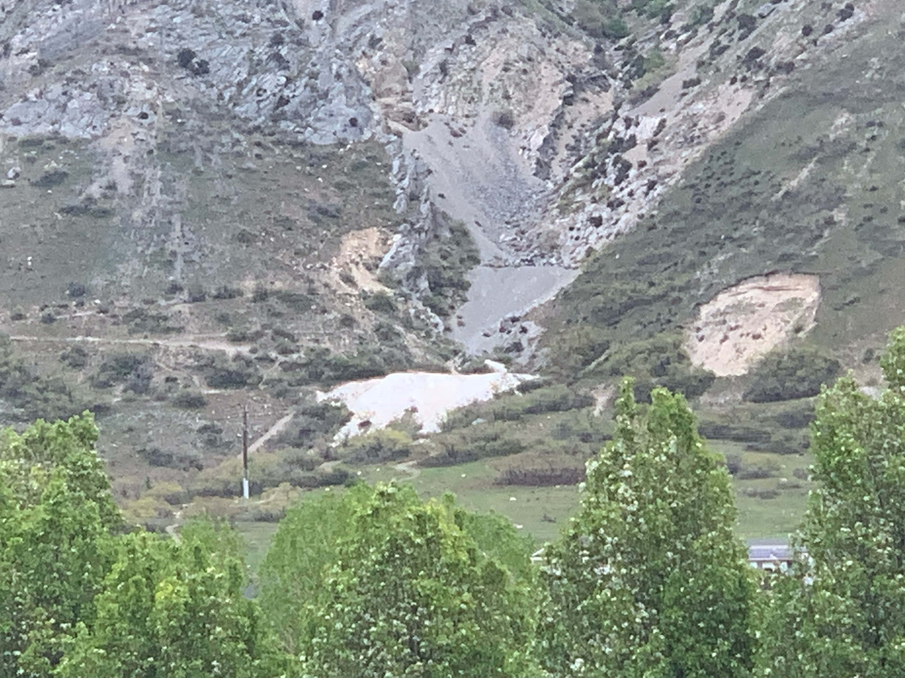
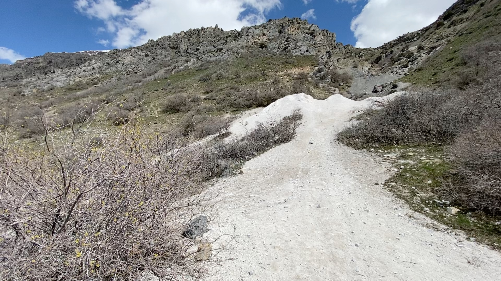
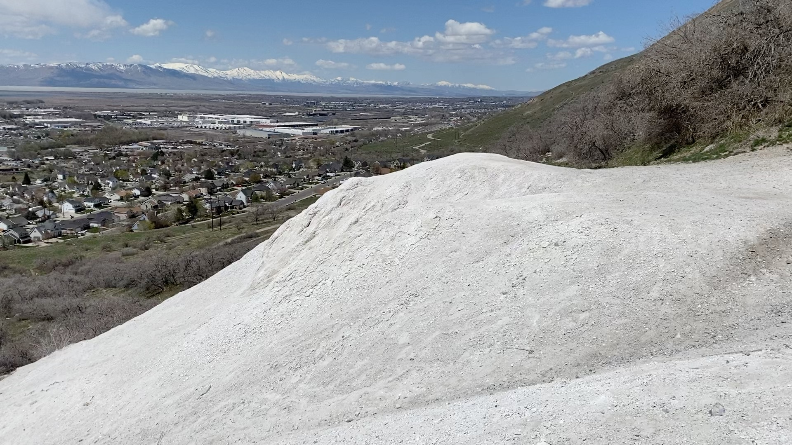
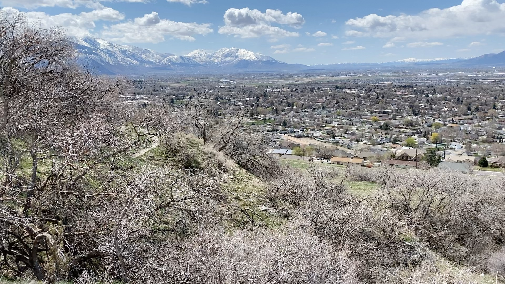
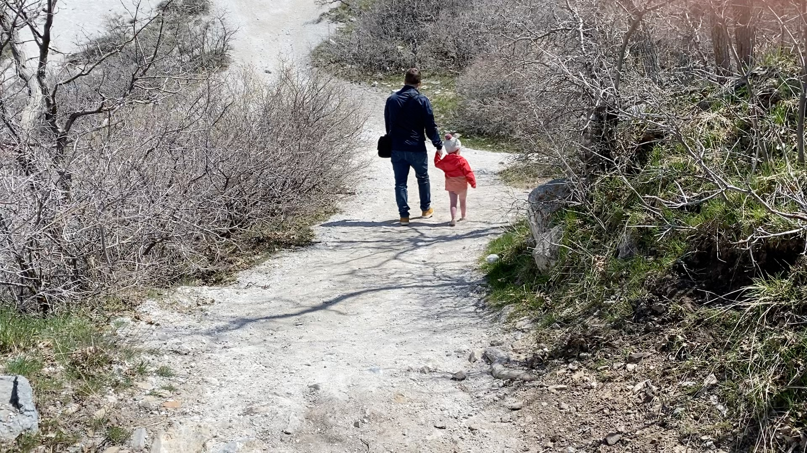
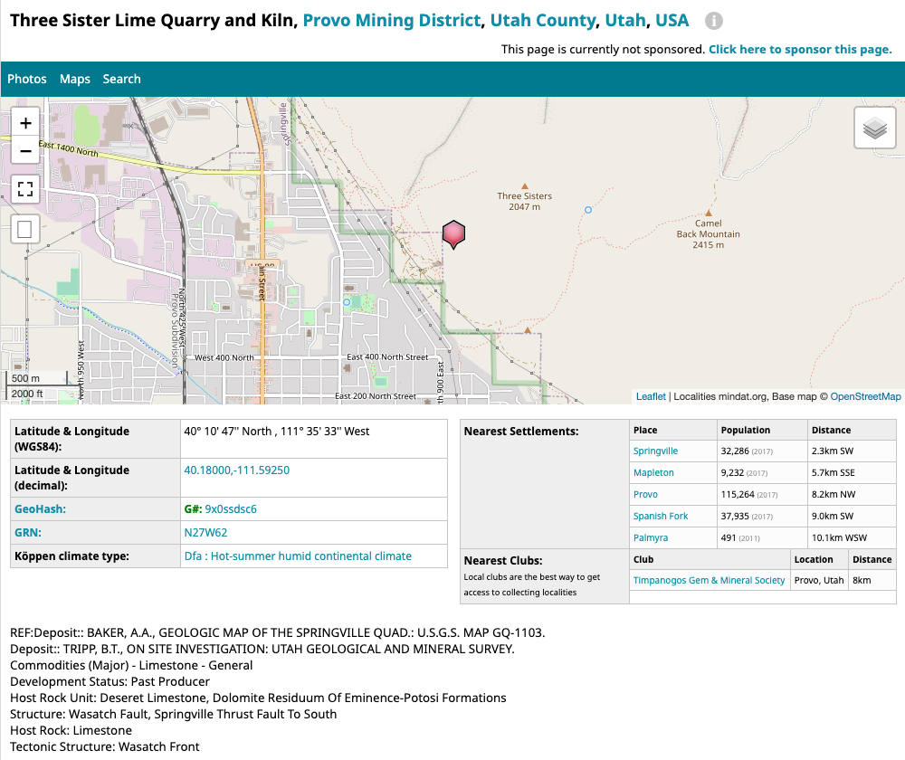
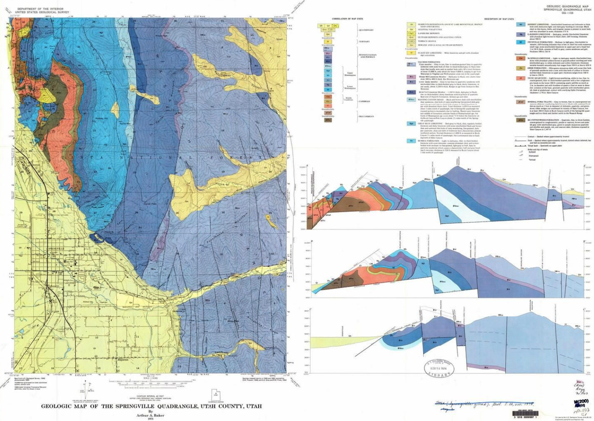

I've always been so curious about things that sit there in plain sight, yet nobody really knows what they are, understands what they are, or even asks.

I don't really know what's interesting about this white patch on the mountain where I grew up, except that it stands out so starkly from all of its surroundings. In the right sunlight, it’s an almost luminescent white patch against a mountain of gray and green. It's just so visible. I have always wondered what it was and how it ever came to be in that spot. I’ve had a nagging question about what that thing was since I was very young. And no one was ever able to give me a satisfactory answer. I wanted to figure it out.

When I was a little kid, we would drive along the roads and highways, and right there, just above the valley floor, floating just over the tops of the trees along the sides of the roads, was this white pile. I'd ask grownups, “What is that pile up there? Is it like a salt pile?” And I remember quite distinctly the frustration of never feeling fully satisfied with any answers that I got.

Later on, when I was 13 or 14, I went on a campout with some friends and we actually went and hiked up and over this patch of white stuff on our way to our campsite. I got to see it firsthand. Those two experiences in particular have made me want to really understand **_what. that. thing. is._**

The white patch from up close...

It has been such a nagging question I've had ever since I was a little kid –I need some closure. I wanted some questions answered that I never really had satisfying answers to. I wanted to solve the mystery of it.

When I was younger I was convinced it was some kind of salt pile that had appeared there as a result of some natural geologic anomaly. But when I got to where I could see and touch it, I realized that it's actually more chalky and grayish than I imagined.

[video of specimens coming soon]

Standing right on top of it, this substance doesn’t look as white as it does from a distance.

There were dirt bike tracks all over it from bikers using it as a jump. In fact, up close, it looks gray. It's not salt, it's chalky, grayish-white, dusty stuff.

That confused me even more, because I didn't know how ten dump truck loads of chalk would have ended up at that spot either. The outermost layer of this chalk-like stuff has mixed with rainwater and kind of hardened a little bit to form an outer shell. But if you dig in a little bit, you can feel that it's grippy like chalk from a chalk bag you might use when you are rock climbing.

Looking down at the valley floor from the “white patch”

I've lived with it there just out of reach my whole life. If you look at that spot on the mountain from the valley floor, you can see it from almost anywhere because it’s almost luminescent. Before there were houses built in the foothills of the mountains, it would have taken most of an hour to hike to get to it, but now you can park and walk to it in a matter of minutes. So my first discovery (back when I hiked over it as a teenager) was realizing that it isn’t far away at all. It’s almost literally in someone’s backyard.

View of the valley floor looking down from atop the pile. The houses highest in the foothills are just a few steps away.

I think this is such a good example of something that is so visible, you can see it from anywhere. Yet we all ignore it. If I describe it to anyone in the local town, they all say, “Oh, yeah, I know exactly what you're talking about.” But they don’t _know_ what I'm talking about. Almost nobody in town knows what it is, and yet everyone sees it almost every day. Everyone knows it exists, yet we know hardly anything about it. This is what has always seemed like such a contradiction to me. How can we ignore so many things that are so present in our lives? What if it’s something really, really cool and we don’t even know because we are so accustomed to it taking up space in our peripheral vision?

## What was this place?

I started researching it to try and answer these questions for myself, “What is it? Why is it where it is? What purpose did it serve?”

I had heard old-timers refer to this spot as a “lime kiln.” But nothing beyond that. So –as one does– I googled “lime kiln Springville, Utah.” I didn’t immediately find any firsthand sources confirming that this thing was the remnants of a lime kiln, but I _did_ find that it had been

I’m a data scientist by profession, so I crave data. It started trickling in once I discovered that the site had been indexed by several mining, geology and hiking sites referring to it as the "Three Sisters Lime Quarry and Kiln" This didn't tell me a whole lot because "Three Sisters" is the name of the mountain that it sits at the base of. But it was encouraging to see somewhat formal sources also referring to the site as a lime kiln.

Further googling led me to discover the existence of a second, similar site about 2.7 miles to the north in southeast Provo.

This site actually had similar piles of white stuff, but also a set of three tall large brick-lined ovens. This confirmed to me that these sites were once home to working lime kilns.

## Since when?

When I get curious about something, it almost always leads me down innumerable additional rabbit holes. As I expanded my google searching I learned that there are lime kilns all up and down the Wasatch Front. I learned that pretty much anywhere the pioneers settled, they needed lime, but I wanted to understand exactly why, and when, and how they used it.

So the next question was, “Okay, _when_ did these two specific lime kiln first come to exist here, and why then?” The answers to that took me back to the arrival of the Mormon pioneers in Utah, and in Springville and Provo specifically.

Since I was a little kid I had been taught that the Mormon Pioneers built their homes with adobe bricks and had even witnessed examples of such construction in the local area. I learned that lime was the principal bonding agent in the mortar that held these buildings together. Shortly after their arrival the pioneer settlers were forced to rapidly transition from building log structures to more economical brick-and-mortar structures and how increasing brick-making sophistication led to the building of many of the large and durable brick buildings that the growing settlement demanded.

I also learned that lime from these kilns was used heavily in the plaster that covered the interior walls of many of these buildings as well as in the production of white paint (whitewash). This made complete sense to since the white color of the mounds had always drawn my eye.

These lime kilns played a big role in the early settlers’ ability to forge a new way of life out of the wilderness that they landed in.

## Why there?

But why that specific spot? Why was the lime accessible in the foothills? Why were the kilns built in that part of town? etc.

Now I had to start to learn about the geology of the area and about the "agglomeration economies" that existed between the kilns and the brickyards that operated in the same part of town. I also learned that certain large building projects affected the need for both bricks and mortar.

Detail of the Geologic Map of the Springville Quadriangle, Source: [ugspub.nr.utah.gov](https://ugspub.nr.utah.gov/)

But more on all that coming soon. This post is getting long enough.

So, the questions and the answers kind of flowed in that order:

**So is it a lime kiln?**

_Yeah, it is. That was confirmed by the discovery of the second site to the north._

**Why was it there?**

_Mostly because pioneers needed lime for mortar to build buildings so they could live._

**Why in that specific spot?**

_Well, because it's right on the fault line. It's the nearest place you can actually get to limestone in the local area._

**What was the lime used for?**

_For mortar, plaster, whitewash, and tanning leather. But also in some really unique and visible ways that that I'll reveal in a later post._

I hope you'll enjoy peering into each of these rabbit holes along with me. The mystery is no longer such a nagging question. But now I have even more questions that are worth investigating, and I think the answers are worth marveling about. That's a more elegant way of saying –they'll blow your mind!
